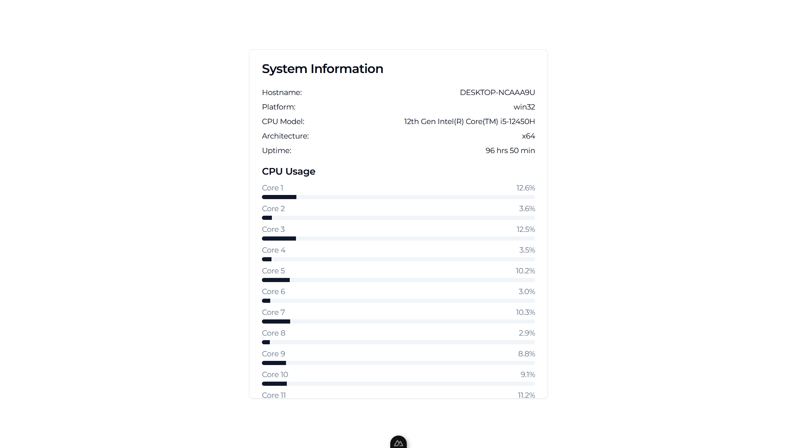

# System Information

Sys-info app that shows your computer's system's information locally.

<picture>
  <source srcset="./pictures/og-dark.png" media="(prefers-color-scheme: dark)">
  <source srcset="./pictures/og-light.png" media="(prefers-color-scheme: light)">
  
</picture>

# Usage

Install dependencies:

```
pnpm install
```

Run locally:
```
pnpm run dev
```
